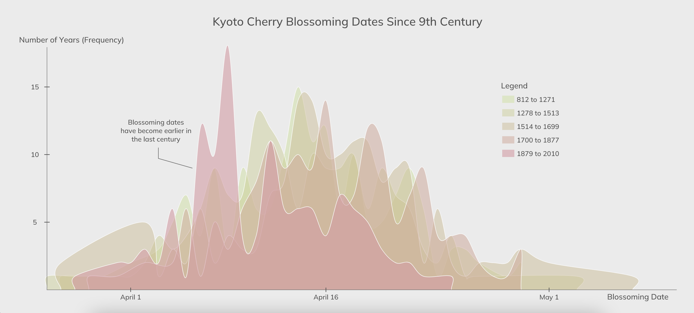

# Kyoto Cherry Blossom Bloomings
A visualization of the annual full-flowering dates of the Japanese cherry blossom (Prunus jamasakura) at Kyoto, Japan.

View the interactive OpenProcessing piece [here](https://openprocessing.org/sketch/1862632). 
- [Data source](http://atmenv.envi.osakafu-u.ac.jp/aono/kyophenotemp4/). 
- Data was collected from 5 different studies for a total of 785 data points spanning the 9th century until 2010.

