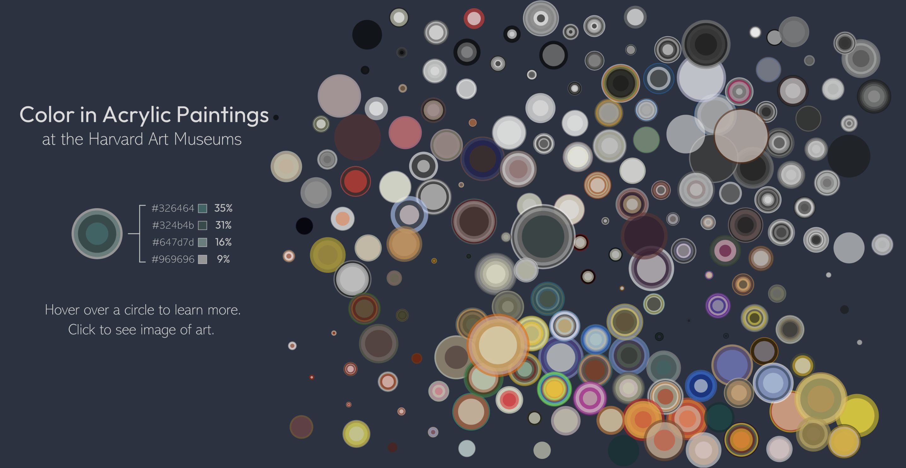
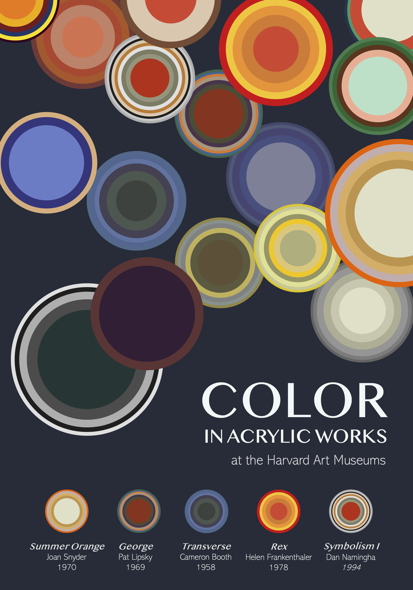

# Color
A visualization of color in acrylic works @ the Harvard Art Museums.
- Dataset loaded using the Harvard Art Museum's API (https://harvardartmuseums.org/collections/api)
- Painting coordinates determined using the UMAP (Uniform Manifold Approximation and Projection) method

Interactive p5.js piece:

Poster:

