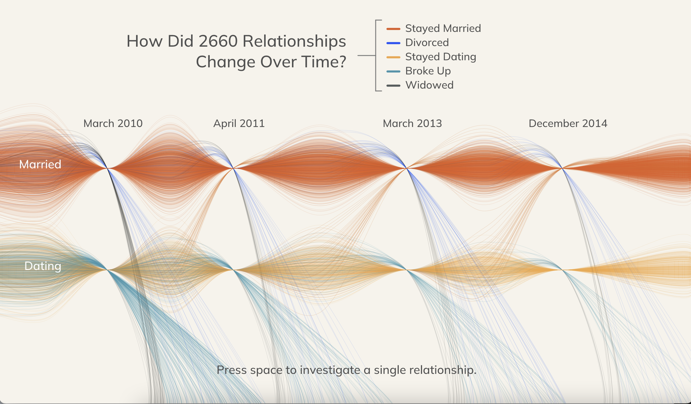

# Relationships Over Time
A visualization of 3000 relationships over time.
View the [interactive version on OpenProcessing](https://openprocessing.org/sketch/1786815).

- Dataset: "How Couples Meet and Stay Together" (https://data.stanford.edu/hcmst)
- Every line represents one relationship.

